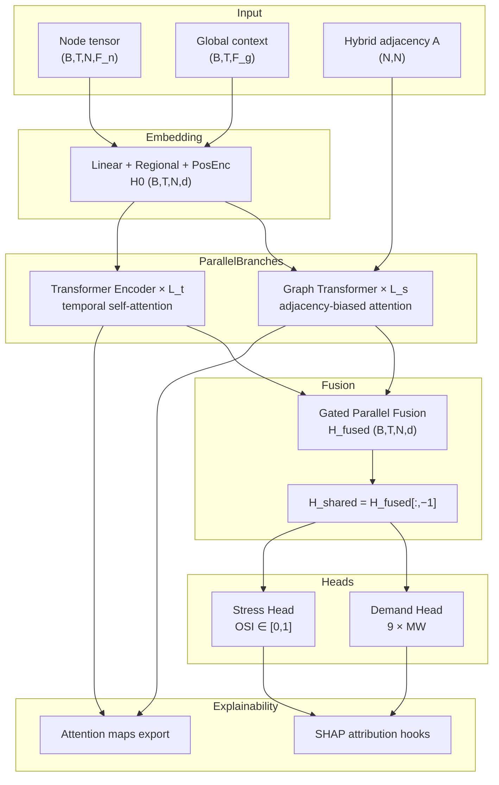
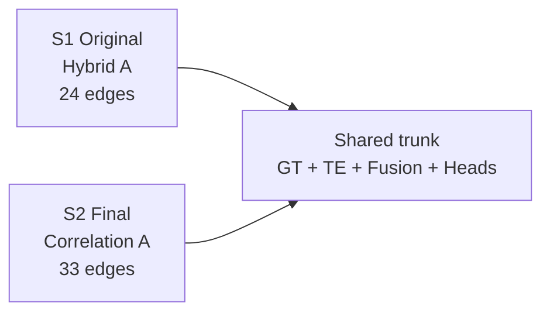

# STGT Architecture Diagram — Phase 09

Generated: 2026-06-24

## PF-STGT block diagram

## Tensor shape trace

| Stage | Shape |
| --- | --- |
| Input node | (B, 7, 9, 9) |
| Input global | (B, 7, 17) |
| Embedded H0 | (B, 7, 9, 128) |
| H_shared | (B, 9, 128) |
| Task 1 output | (B, 9) |
| Task 2 output | (B, 1) |

---

## S2 (final) vs S1 (original) diagram note

The block diagram above describes the **shared PF-STGT trunk** used by both S1 and S2.
For **S2**, replace the hybrid adjacency input with the **correlation graph** built at
τ = 0.65 (33 undirected edges, 91.7% density). All other blocks are unchanged.

Frozen checkpoint: `experiments/experiment_03_ablation_studies/checkpoints/A6/seed_42/best.pt`
