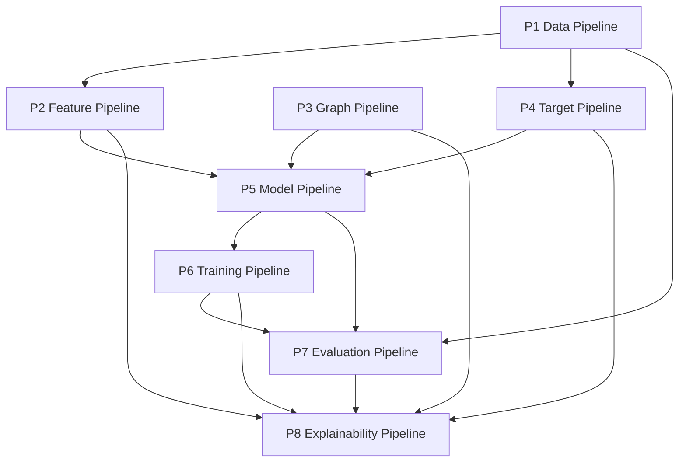

# Dependency Map — Phase 16A

Generated: 2026-06-24
Status: **FROZEN BLUEPRINT**

## Pipeline dependency graph



## Inter-pipeline edges

| from_pipeline   | to_pipeline   | artefact              | description                     |
|:----------------|:--------------|:----------------------|:--------------------------------|
| P1              | P2            | DataFrame rows        | Feature extraction per timestep |
| P1              | P4            | DataFrame rows        | Target columns at t+1           |
| P2              | P5            | node/global tensors   | Model input embedding           |
| P3              | P5            | adjacency bias        | Spatial encoder bias            |
| P4              | P5            | demand, osi targets   | Supervision (training only)     |
| P5              | P6            | ModelOutput           | Loss computation                |
| P6              | P7            | checkpoints           | Load best weights for test      |
| P6              | P8            | checkpoints           | XAI on trained model            |
| P7              | P8            | case-study dates      | Stratified XAI selection        |
| P2              | P8            | feature groups G1–G11 | SHAP coalition mapping          |
| P3              | P8            | adjacency overlay     | Attention visualisation         |
| P4              | P8            | OSI components        | Stress driver validation        |
| P1              | P7            | test DataLoader       | Held-out evaluation             |
| P5              | P7            | predictions           | Metric computation              |

## External artefact dependencies (read-only)

| Artefact | MD5 (locked) | Consumed by |
| --- | --- | --- |
| `data/features/train_features.parquet` | `b8b3bda95d0fd6cc65f4910d85a98e16` | P1, P2, P3 |
| `data/interim/bangladesh_smartgrid_clean.parquet` | `4255024d735a91a4b53b2edee203d0ca` | P1, P2, P3 |
| `references/metadata/literature_catalog.csv` | `4b362b66f86444c05ad320e38fa7a348` | P1, P2, P3 |
| `graphs/adjacency_matrix.csv` | `dacb7ac3a827d00a4b61ea9400e75686` | P1, P2, P3 |

## Python package dependencies (implementation)

| Package | Version pin | Used in |
| --- | --- | --- |
| torch | ≥2.0 | P5, P6 |
| pandas | existing | P1, P2, P4 |
| pyarrow | existing | P1 |
| numpy | existing | all |
| scikit-learn | existing | P7 metrics, B01–B03 |
| xgboost | optional | B03 |
| shap | optional | P8 |
| scipy | optional | P7 statistics |
| matplotlib | optional | P8 figures |

## Module import DAG (simplified)

```
utils.config
    ↑
data → features → datasets ← graph
    ↓         ↓
         models ← losses
            ↓
        training
            ↓
    evaluation ← metrics
            ↓
    explainability → visualization
```

## Phase → pipeline traceability

| Phase | Pipeline | Key frozen input |
| --- | --- | --- |
| 04 | P1 | Split boundaries |
| 05B/06 | P2 | Feature parquet, scaler |
| 08 | P3 | adjacency_matrix.csv |
| 08.5 | P4 | OSI formula, h=1 |
| 09 | P5 | Architecture spec |
| 10/11 | P6 | Loss, HPO |
| 12 | P8 | XAI protocol |
| 13 | P5,P6,P7 | Ablation variants |
| 14 | P7 | Error taxonomy |
| 15 | P7,P8 | Tables, figures |

## module_count_by_pipeline

| pipeline   |   module_count |
|:-----------|---------------:|
| ALL        |              3 |
| P1         |              4 |
| P1,P2,P4   |              1 |
| P2         |              5 |
| P3         |              3 |
| P4         |              3 |
| P5         |              9 |
| P6         |              5 |
| P7         |              7 |
| P8         |              5 |
